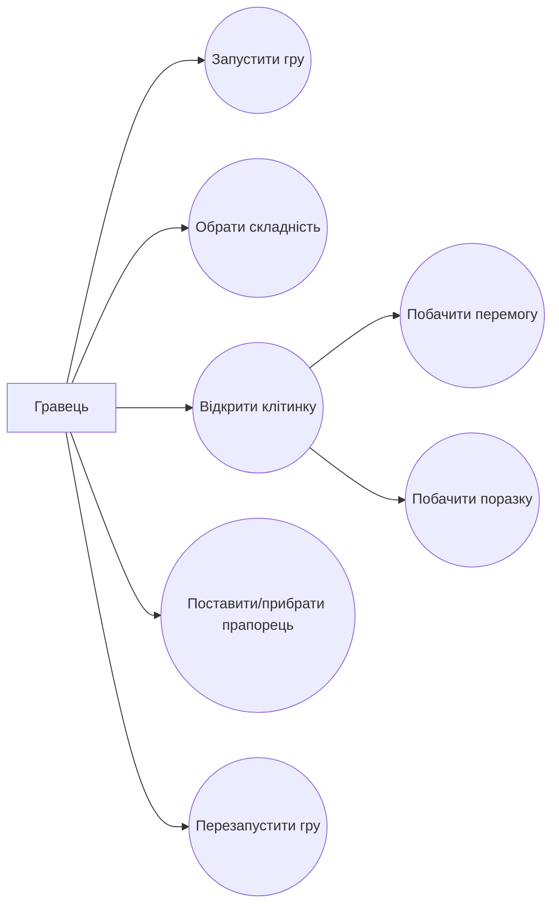
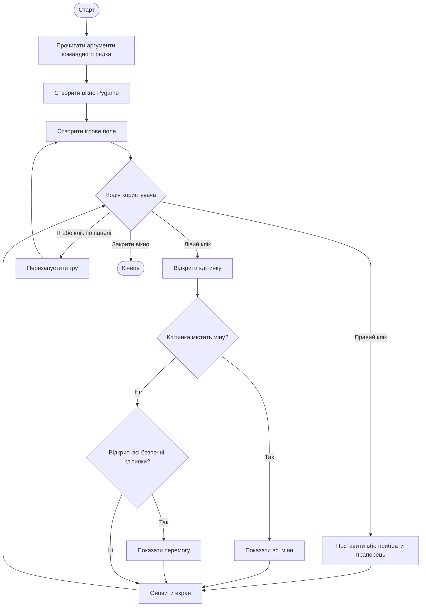
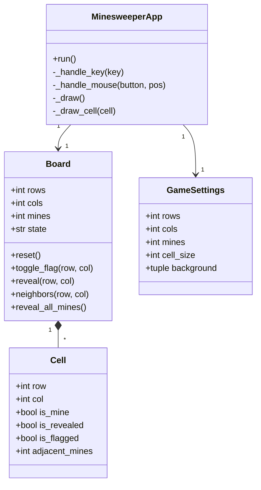

# UML-діаграми

Діаграми записані у форматі Mermaid. Їх можна переглянути безпосередньо на GitHub або вставити у звіт.

## Діаграма варіантів використання

## Діаграма діяльності

## Діаграма класів

